# z_bmi10

### h vs. cmf (F-test p-value)

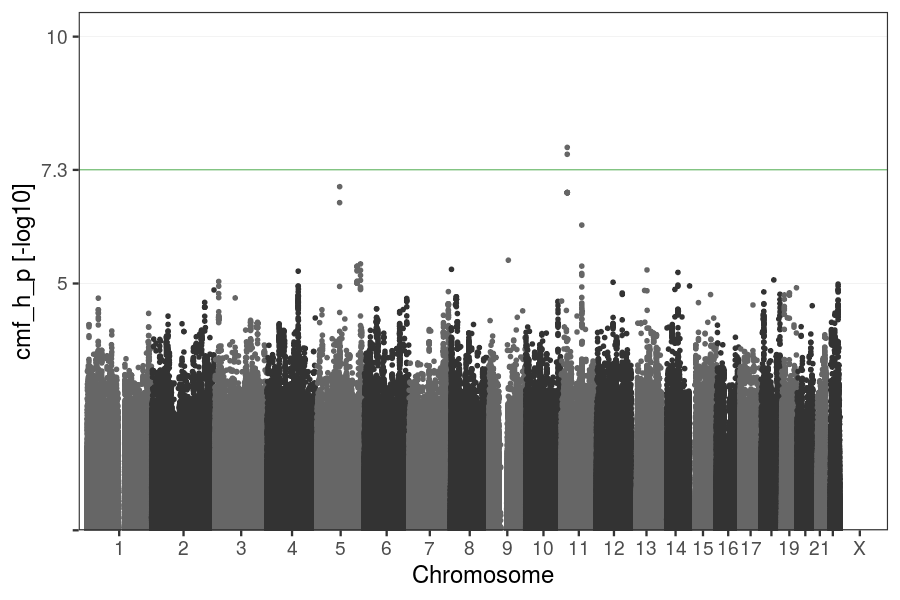

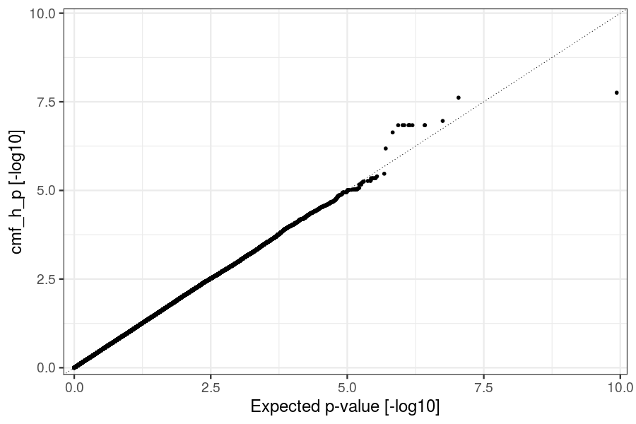

### h B1 (Prob(|t| > 0))

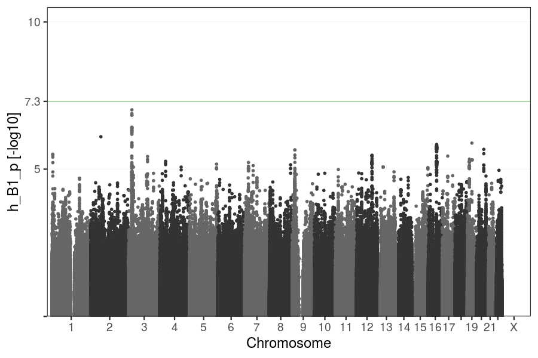

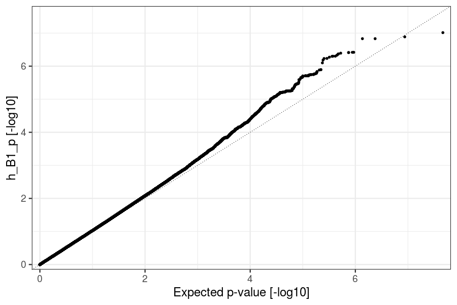

### h B2 (Prob(|t| > 0))

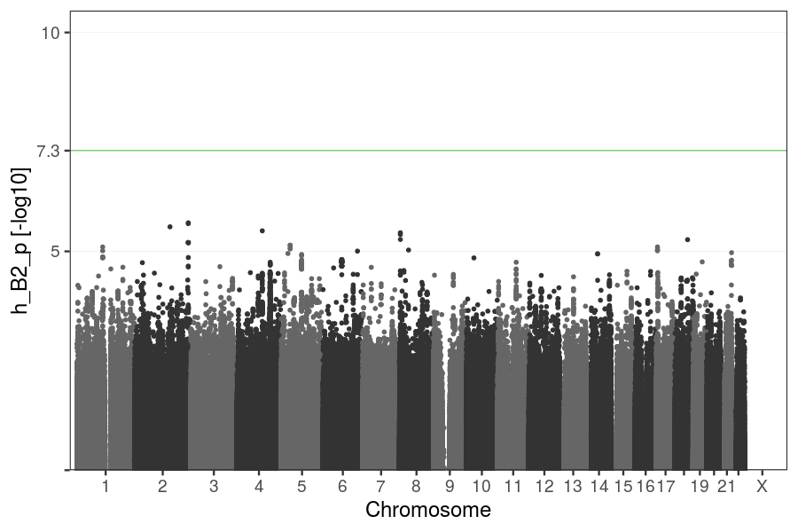

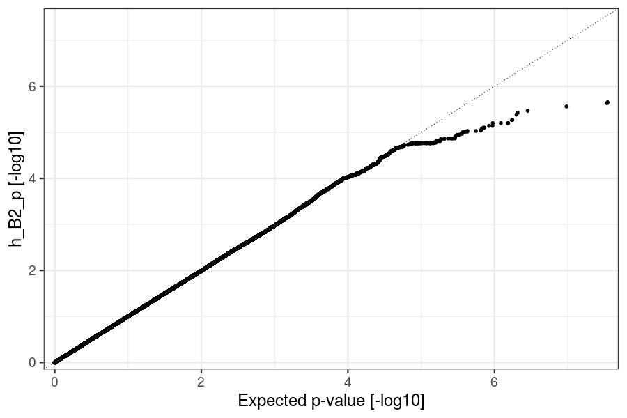

### h B3 (Prob(|t| > 0))

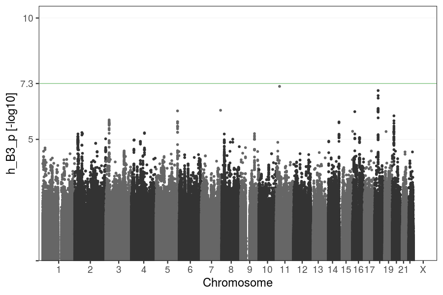

### h B4 (Prob(|t| > 0))

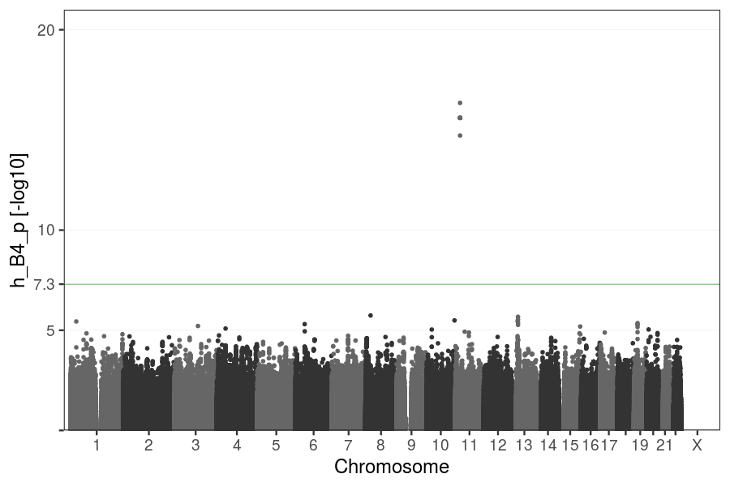

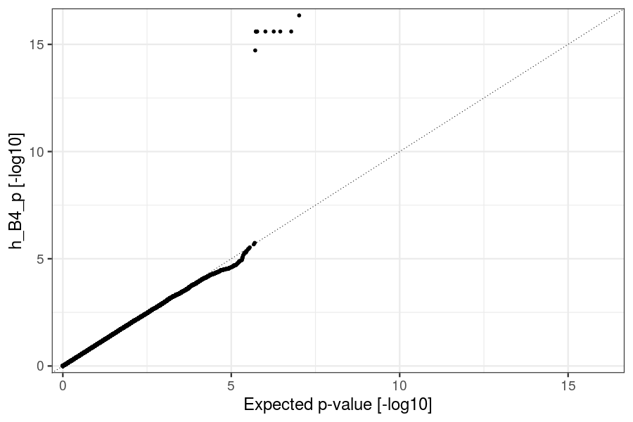

### cmf Bc (Prob(|t| > 0))

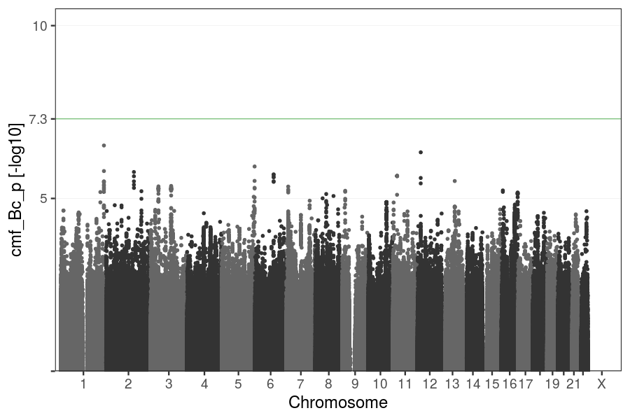

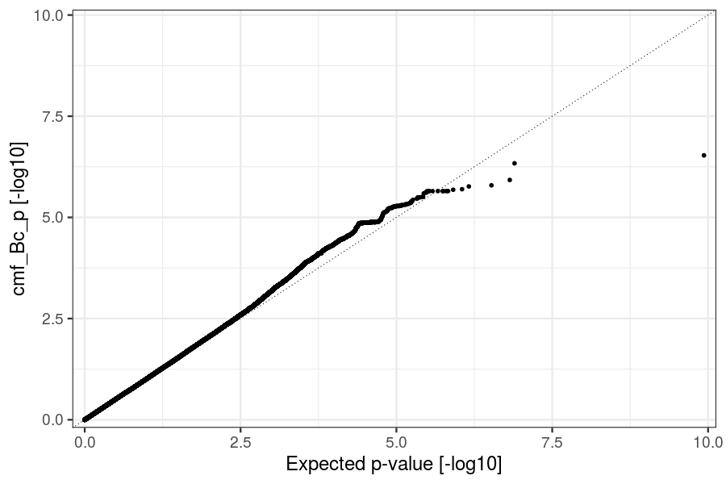

### cmf Bm (Prob(|t| > 0))

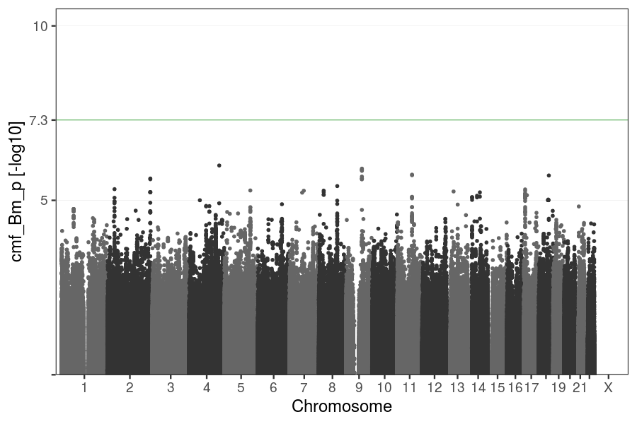

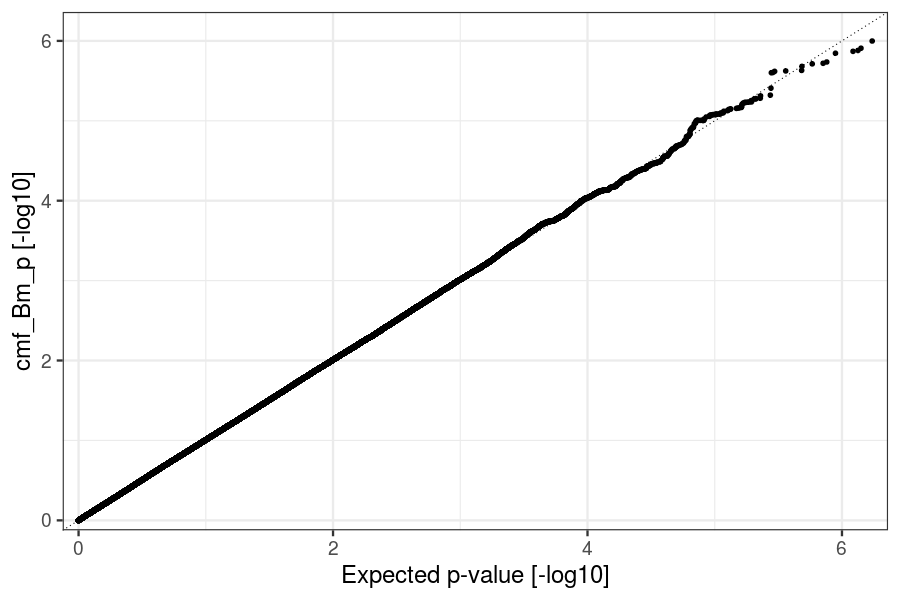

### cmf Bf (Prob(|t| > 0))

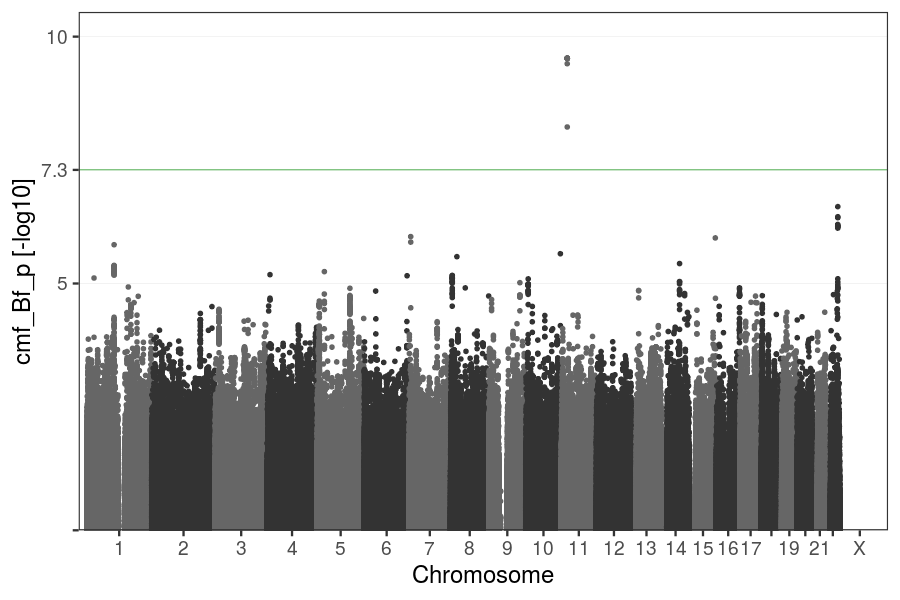

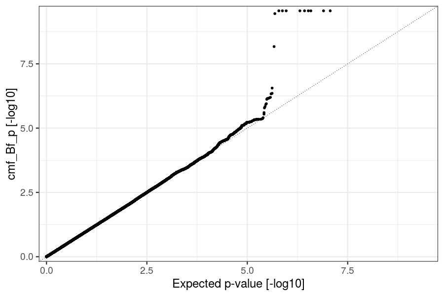

### cmf_mt Bmt (Prob(|t| > 0))

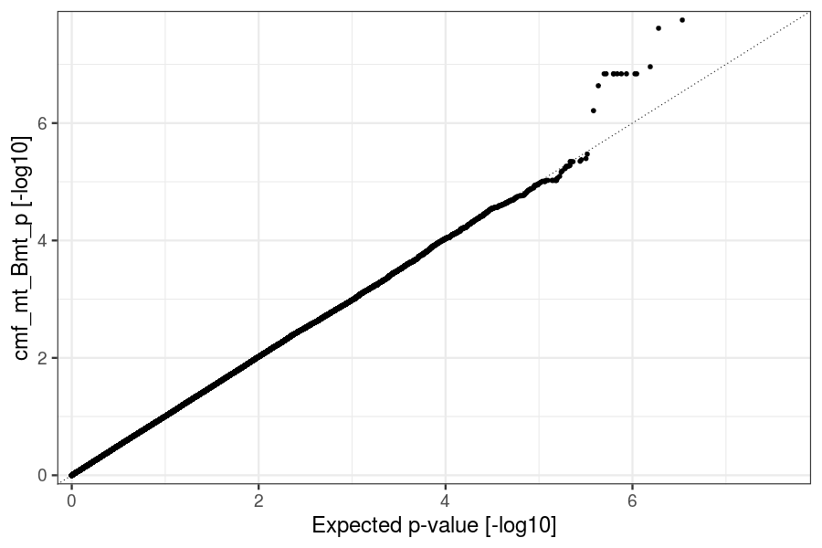

### cmf_ft Bft (Prob(|t| > 0))

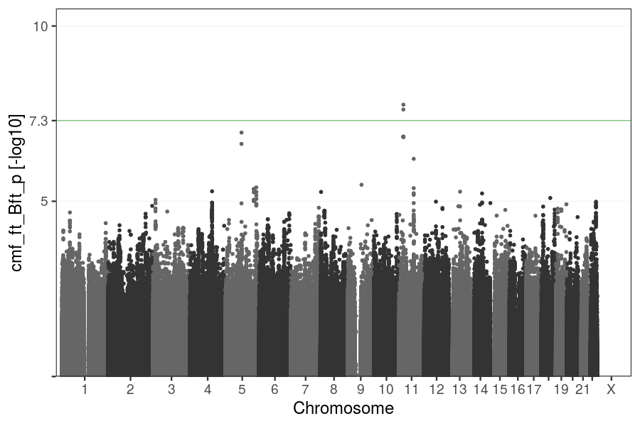

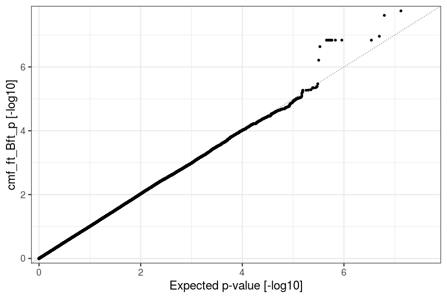

