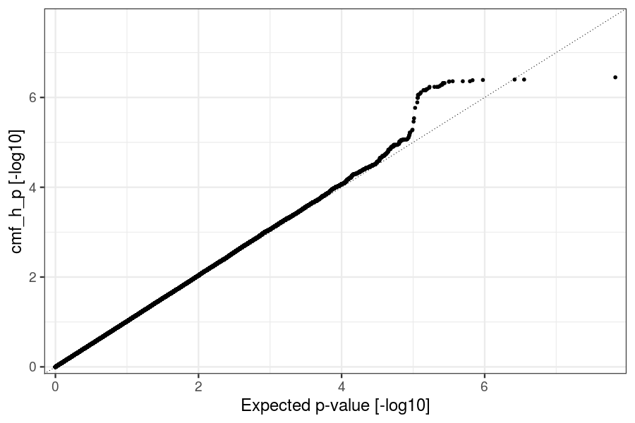
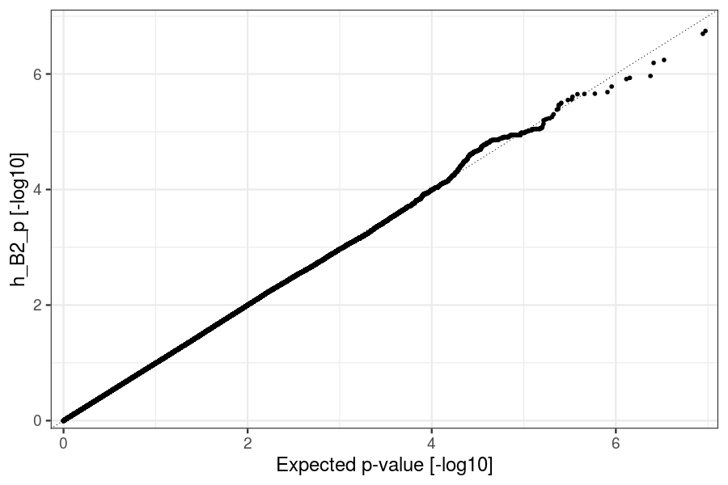
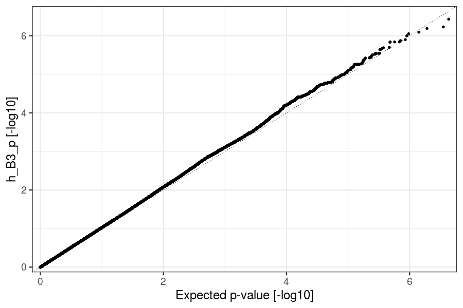
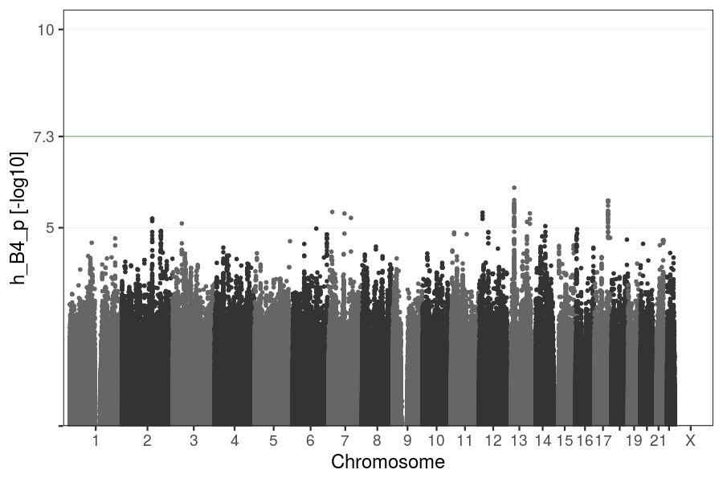
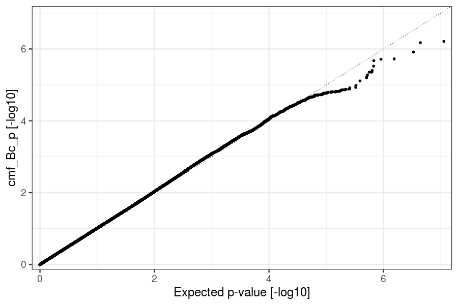
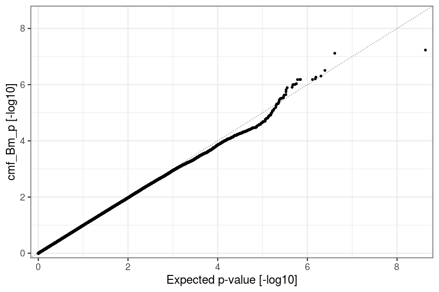
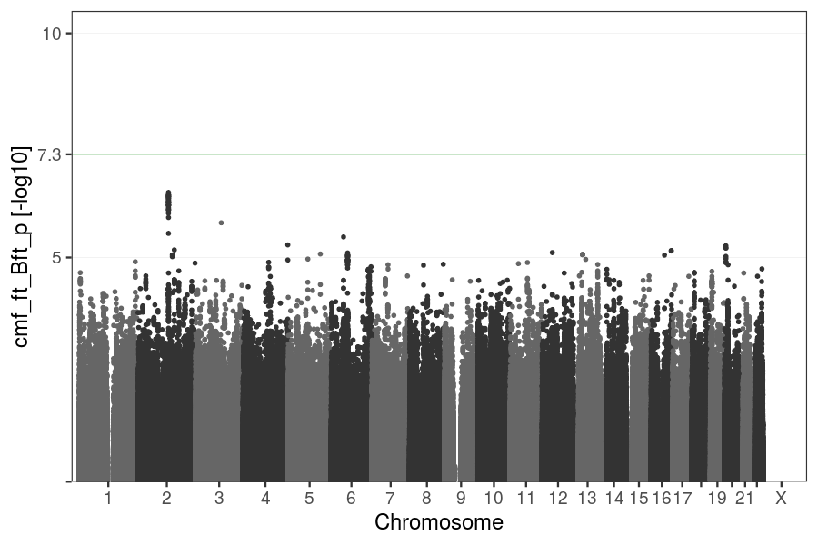

# z_bmi9

TrioGen v.0.3.0-beta on 27,451 full trios, ADHD cases, related, and ethnic outliers excluded. 10 PCs and genotyping batch as covariates. Reference panel AF > 5%, info score >= 0.7, singularities excluded

z_BMI “à la Chris”, see details [here](../pheno/plots.md):

- not the same as the pheno tables used so far!

- BMI adjusted for pregnancy duration!

4 Models:

- h: `y = β1 h1 + β2 h2 + β3 h3 + β4 h4  + ε`

- cmf: `y = βm (h1 + h2) + βc (h1 + h3) + βf (h3 + h4) + ε`

- cmf_mt: `y = βm (h1 + h2) + βc (h1 + h3) + βf (h3 + h4) + βmt h1 + ε`

- cmf_ft: `y = βm (h1 + h2) + βc (h1 + h3) + βf (h3 + h4) + βft h1 + ε`

### h vs. cmf (F-test p-value)

### h B1 (Prob(|t| > 0))

### h B2 (Prob(|t| > 0))

### h B3 (Prob(|t| > 0))

### h B4 (Prob(|t| > 0))

### cmf Bc (Prob(|t| > 0))

### cmf Bm (Prob(|t| > 0))

### cmf Bf (Prob(|t| > 0))

### cmf_mt Bmt (Prob(|t| > 0))

### cmf_ft Bft (Prob(|t| > 0))

